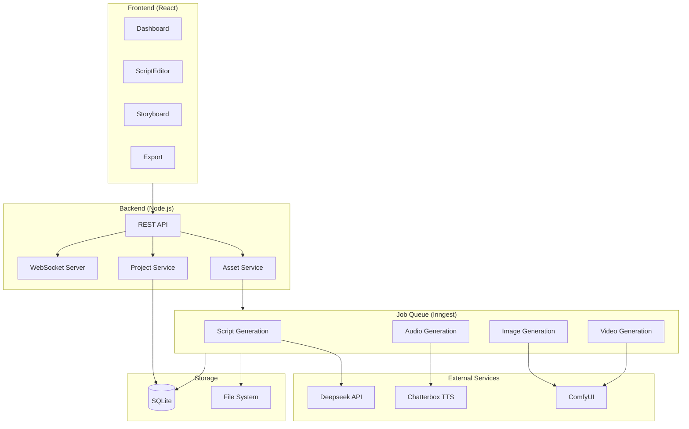

# System Architecture: VideoGen AI Studio

**Date:** 2026-01-16
**Architect:** matte
**Version:** 1.0
**Project Type:** web-app
**Project Level:** 3 (Complex)
**Status:** Draft

---

## Document Overview

This document defines the system architecture for VideoGen AI Studio. It provides the technical blueprint for implementation, addressing all functional and non-functional requirements from the PRD.

**Related Documents:**
- Product Requirements Document: `docs/prd-videogen-ai-studio-2026-01-16.md`
- Product Brief: `docs/product-brief-videogen-ai-studio-2026-01-16.md`
- Original Technical PRD: `docs/PRD.md`

---

## Executive Summary

VideoGen AI Studio is a local-first AI video creation platform using an event-driven architecture. The system prioritizes local GPU processing for cost efficiency, with only script generation requiring cloud API access. An Inngest job queue orchestrates all GPU-intensive tasks, enabling responsive UI, parallel processing, and reliable cascading regeneration.

**Key Architectural Decisions:**
- Event-driven architecture for async GPU processing
- Local-first processing (ComfyUI, Chatterbox) to minimize costs
- SQLite for robust data persistence
- Inngest for job queue orchestration
- Modular service design for extensibility

---

## Architectural Drivers

These requirements heavily influence architectural decisions:

| Priority | Driver | NFRs | Architectural Impact |
|----------|--------|------|---------------------|
| **1** | Local-First Processing | NFR-002, NFR-012 | All generation runs locally; only Deepseek is cloud |
| **2** | GPU Utilization | NFR-002, NFR-003 | Job queue manages GPU contention and parallelism |
| **3** | Background Processing | NFR-005, NFR-007 | Async jobs, persistent queue, responsive UI |
| **4** | Cascading Regeneration | FR-8xx | Event chains trigger downstream asset updates |
| **5** | Model Extensibility | NFR-008, NFR-009 | Plugin-style ComfyUI workflow architecture |

---

## System Overview

### High-Level Architecture

The system follows an **Event-Driven Architecture** with a local job queue:

```
┌─────────────────────────────────────────────────────────────────┐
│                        FRONTEND LAYER                            │
│  ┌─────────────────────────────────────────────────────────┐    │
│  │              React 19 + TypeScript + Vite                │    │
│  │  ┌──────────┐ ┌──────────┐ ┌──────────┐ ┌──────────┐    │    │
│  │  │Dashboard │ │  Script  │ │Storyboard│ │  Export  │    │    │
│  │  │   View   │ │  Editor  │ │   View   │ │   View   │    │    │
│  │  └──────────┘ └──────────┘ └──────────┘ └──────────┘    │    │
│  └─────────────────────────────────────────────────────────┘    │
└─────────────────────────┬───────────────────────────────────────┘
                          │ REST API + WebSocket (Progress)
┌─────────────────────────▼───────────────────────────────────────┐
│                        BACKEND LAYER                             │
│  ┌─────────────────────────────────────────────────────────┐    │
│  │              Node.js + Express + TypeScript              │    │
│  │  ┌──────────┐ ┌──────────┐ ┌──────────┐ ┌──────────┐    │    │
│  │  │ Project  │ │  Asset   │ │  Export  │ │ Character│    │    │
│  │  │ Service  │ │ Service  │ │ Service  │ │ Service  │    │    │
│  │  └──────────┘ └──────────┘ └──────────┘ └──────────┘    │    │
│  └─────────────────────────────────────────────────────────┘    │
│  ┌─────────────────────────────────────────────────────────┐    │
│  │                    SQLite                            │    │
│  │      Projects, Sections, Sentences, Characters           │    │
│  └─────────────────────────────────────────────────────────┘    │
└─────────────────────────┬───────────────────────────────────────┘
                          │ Events (Inngest)
┌─────────────────────────▼───────────────────────────────────────┐
│                     JOB QUEUE LAYER                              │
│  ┌─────────────────────────────────────────────────────────┐    │
│  │                      Inngest                             │    │
│  │  ┌──────────┐ ┌──────────┐ ┌──────────┐ ┌──────────┐    │    │
│  │  │  Script  │ │  Audio   │ │  Image   │ │  Video   │    │    │
│  │  │   Jobs   │ │   Jobs   │ │   Jobs   │ │   Jobs   │    │    │
│  │  └──────────┘ └──────────┘ └──────────┘ └──────────┘    │    │
│  └─────────────────────────────────────────────────────────┘    │
└───┬─────────────┬─────────────┬─────────────┬───────────────────┘
    │             │             │             │
┌───▼───┐   ┌─────▼─────┐   ┌───▼───┐   ┌─────▼─────┐
│Deepseek│   │Chatterbox │   │ComfyUI│   │  ComfyUI  │
│  API   │   │TTS Docker │   │ Image │   │   Video   │
│(Cloud) │   │  (Local)  │   │(Local)│   │  (Local)  │
└────────┘   └───────────┘   └───────┘   └───────────┘
     │             │             │             │
     └─────────────┴─────────────┴─────────────┘
                          │
                    File Storage
                   (Local Filesystem)
```

### Architecture Diagram (Mermaid)



### Architectural Pattern

**Pattern:** Event-Driven Architecture with Local Job Queue

**Rationale:**
1. **Async Processing**: GPU tasks take seconds to minutes; UI must stay responsive
2. **Cascading Updates**: Events naturally chain (script change → audio → image → video)
3. **Retry & Resilience**: Inngest handles failures, retries, and job persistence
4. **Parallelism Control**: Queue manages GPU contention (one video at a time, multiple audio in parallel)
5. **Observability**: Easy to track job status and progress

---

## Technology Stack

### Frontend

**Choice:** React 19 + TypeScript + Vite + Tailwind CSS

**Rationale:**
- Already implemented in current codebase
- Fast development with Vite HMR
- TypeScript provides type safety across stack
- Tailwind enables rapid UI development

**Trade-offs:**
- ✓ Gain: Developer productivity, modern tooling
- ✗ Lose: Slightly larger bundle than vanilla JS

### Backend

**Choice:** Node.js + Express + TypeScript

**Rationale:**
- Same language as frontend (TypeScript everywhere)
- Excellent async I/O for handling multiple service calls
- Native Inngest SDK support
- Large ecosystem for integrations

**Trade-offs:**
- ✓ Gain: Code sharing, developer familiarity, async handling
- ✗ Lose: Less CPU performance than Go/Rust (not an issue here)

### Database

**Choice:** SQLite + Drizzle ORM + Drizzle Studio

**Rationale:**
- Zero configuration, file-based database
- Drizzle Studio provides nice UI for viewing data
- Perfect for single-user local application
- No Docker container needed
- Excellent performance for this use case

**Trade-offs:**
- ✓ Gain: Simplicity, no setup, built-in viewer via Drizzle Studio
- ✗ Lose: Less scalable than SQLite (not needed for solo use)

### Job Queue

**Choice:** Inngest

**Rationale:**
- Purpose-built for event-driven workflows
- Built-in retries, rate limiting, parallelism control
- Excellent TypeScript SDK
- Local development mode
- Persistent job state survives restarts

**Trade-offs:**
- ✓ Gain: Reliability, observability, cascading event chains
- ✗ Lose: Additional dependency, learning curve

### Infrastructure

**Choice:** Local Docker Compose stack

**Components:**
- SQLite container
- Chatterbox TTS container
- ComfyUI (native or container)
- Inngest Dev Server

**Rationale:**
- Zero cloud costs for generation
- Full GPU utilization
- Reproducible development environment

### Third-Party Services

| Service | Purpose | Cloud/Local | Cost Model |
|---------|---------|-------------|------------|
| Deepseek API | Script generation | Cloud | Pay per token |
| Chatterbox TTS | Voice synthesis | Local Docker | Free |
| ComfyUI | Image/video generation | Local | Free |
| Inngest | Job orchestration | Local dev server | Free |

### Development & Deployment

| Tool | Purpose |
|------|---------|
| Git | Version control |
| pnpm | Package management |
| Docker Compose | Local services orchestration |
| Vitest | Unit/integration testing |
| Playwright | E2E testing |
| ESLint + Prettier | Code quality |

---

## System Components

### Component 1: Project Service

**Purpose:** Manages project lifecycle, scripts, and sections

**Responsibilities:**
- Create, read, update, delete projects
- Script generation via Deepseek
- Auto-segmentation into sections/sentences
- Track project state and metadata

**Interfaces:**
- REST API endpoints (`/api/projects/*`)
- Inngest events (`project.created`, `script.generated`)

**Dependencies:**
- SQLite (data persistence)
- Deepseek API (script generation)

**FRs Addressed:** FR-101 to FR-107

---

### Component 2: Asset Service

**Purpose:** Orchestrates asset generation (audio, images, video)

**Responsibilities:**
- Trigger generation jobs via Inngest
- Track asset generation status
- Handle cascading regeneration logic
- Store generated files

**Interfaces:**
- REST API endpoints (`/api/assets/*`)
- Inngest events (`audio.generate`, `image.generate`, `video.generate`)
- WebSocket for progress updates

**Dependencies:**
- Inngest (job queue)
- File system (asset storage)
- SQLite (asset metadata)

**FRs Addressed:** FR-301 to FR-508, FR-801 to FR-805

---

### Component 3: Character Service

**Purpose:** Manages character library and reference images

**Responsibilities:**
- CRUD operations for characters
- Store and retrieve reference images
- Associate characters with projects

**Interfaces:**
- REST API endpoints (`/api/characters/*`)

**Dependencies:**
- SQLite (character data)
- File system (reference images)

**FRs Addressed:** FR-201 to FR-204

---

### Component 4: Export Service

**Purpose:** Packages and exports project assets

**Responsibilities:**
- Generate sequential file naming
- Organize folder structure
- Create metadata files
- Trigger batch export

**Interfaces:**
- REST API endpoints (`/api/export/*`)

**Dependencies:**
- File system (read generated assets, write exports)
- SQLite (project structure)

**FRs Addressed:** FR-701 to FR-706

---

### Component 5: ComfyUI Client

**Purpose:** Interface to local ComfyUI instance

**Responsibilities:**
- Queue image/video generation workflows
- Poll for job completion
- Handle workflow versioning
- Download generated assets

**Interfaces:**
- Internal service (called by Inngest jobs)
- ComfyUI WebSocket/REST API

**Dependencies:**
- ComfyUI (local instance)
- Workflow JSON files

**FRs Addressed:** FR-401 to FR-508

---

### Component 6: TTS Client

**Purpose:** Interface to Chatterbox TTS Docker service

**Responsibilities:**
- Generate audio from text
- Handle voice selection
- Return audio files

**Interfaces:**
- Internal service (called by Inngest jobs)
- Chatterbox HTTP API

**Dependencies:**
- Chatterbox TTS Docker container

**FRs Addressed:** FR-301 to FR-304

---

## Data Architecture

### Data Model

```
┌──────────────────┐       ┌──────────────────┐
│     Project      │       │    Character     │
├──────────────────┤       ├──────────────────┤
│ id (PK)          │       │ id (PK)          │
│ name             │       │ name             │
│ target_duration  │       │ description      │
│ visual_style     │       │ reference_images │
│ created_at       │       │ style_lora       │
│ updated_at       │       │ created_at       │
└────────┬─────────┘       └──────────────────┘
         │                          │
         │ 1:N                      │
         ▼                          │
┌──────────────────┐                │
│  ProjectCast     │◄───────────────┘
├──────────────────┤     N:M
│ project_id (FK)  │
│ character_id (FK)│
└──────────────────┘
         │
         │
┌────────▼─────────┐
│     Section      │
├──────────────────┤
│ id (PK)          │
│ project_id (FK)  │
│ title            │
│ order            │
│ created_at       │
└────────┬─────────┘
         │ 1:N
         ▼
┌──────────────────┐
│    Sentence      │
├──────────────────┤
│ id (PK)          │
│ section_id (FK)  │
│ text             │
│ order            │
│ image_prompt     │
│ video_prompt     │
│ camera_movement  │
│ motion_strength  │
│ audio_file       │
│ audio_duration   │
│ image_file       │
│ video_file       │
│ status           │
│ created_at       │
│ updated_at       │
└──────────────────┘
```

### Database Design

```typescript
// Drizzle ORM Schema (src/backend/db/schema.ts)
import { sqliteTable, text, integer, real } from 'drizzle-orm/sqlite-core';

export const projects = sqliteTable('projects', {
  id: text('id').primaryKey(),
  name: text('name').notNull(),
  targetDuration: integer('target_duration').notNull(), // minutes
  visualStyle: text('visual_style').notNull(),
  createdAt: integer('created_at', { mode: 'timestamp' }),
  updatedAt: integer('updated_at', { mode: 'timestamp' }),
});

export const characters = sqliteTable('characters', {
  id: text('id').primaryKey(),
  name: text('name').notNull(),
  description: text('description'),
  referenceImages: text('reference_images', { mode: 'json' }).$type<string[]>(),
  styleLora: text('style_lora'),
  createdAt: integer('created_at', { mode: 'timestamp' }),
});

export const projectCast = sqliteTable('project_cast', {
  projectId: text('project_id').references(() => projects.id),
  characterId: text('character_id').references(() => characters.id),
});

export const sections = sqliteTable('sections', {
  id: text('id').primaryKey(),
  projectId: text('project_id').references(() => projects.id),
  title: text('title').notNull(),
  order: integer('order').notNull(),
  createdAt: integer('created_at', { mode: 'timestamp' }),
});

export const sentences = sqliteTable('sentences', {
  id: text('id').primaryKey(),
  sectionId: text('section_id').references(() => sections.id),
  text: text('text').notNull(),
  order: integer('order').notNull(),
  imagePrompt: text('image_prompt'),
  videoPrompt: text('video_prompt'),
  cameraMovement: text('camera_movement').default('static'),
  motionStrength: real('motion_strength').default(0.5),
  audioFile: text('audio_file'),
  audioDuration: integer('audio_duration'), // milliseconds
  imageFile: text('image_file'),
  videoFile: text('video_file'),
  status: text('status').default('pending'),
  createdAt: integer('created_at', { mode: 'timestamp' }),
  updatedAt: integer('updated_at', { mode: 'timestamp' }),
});

export const generationJobs = sqliteTable('generation_jobs', {
  id: text('id').primaryKey(),
  sentenceId: text('sentence_id').references(() => sentences.id),
  jobType: text('job_type').notNull(), // 'audio', 'image', 'video'
  status: text('status').notNull(), // 'queued', 'running', 'completed', 'failed'
  inngestRunId: text('inngest_run_id'),
  errorMessage: text('error_message'),
  startedAt: integer('started_at', { mode: 'timestamp' }),
  completedAt: integer('completed_at', { mode: 'timestamp' }),
  createdAt: integer('created_at', { mode: 'timestamp' }),
});
```

**View database with Drizzle Studio:**
```bash
npx drizzle-kit studio
# Opens browser UI at http://localhost:4983
```

### Data Flow

**Script Generation Flow:**
```
User Input → API → Deepseek API → Parse Response
    → Create Sections → Create Sentences → Save to DB
    → Return to Frontend
```

**Asset Generation Flow:**
```
Frontend triggers "Generate All" → API creates Inngest events

For each sentence:
  1. audio.generate event → Chatterbox TTS → Save audio file → Update DB
  2. image.generate event → ComfyUI workflow → Save image file → Update DB
  3. video.generate event → ComfyUI workflow → Save video file → Update DB

WebSocket pushes progress updates to frontend
```

**Cascading Regeneration Flow:**
```
User edits sentence text → API detects change
  → Mark audio/image/video as stale
  → Queue audio.regenerate event
  → On audio complete: queue image.regenerate
  → On image complete: queue video.regenerate
  → WebSocket updates for each step
```

---

## API Design

### API Architecture

**Style:** RESTful with WebSocket for real-time updates

**Authentication:** None (local single-user app)

**Versioning:** URL prefix `/api/v1/`

**Response Format:** JSON

```typescript
interface ApiResponse<T> {
  success: boolean;
  data?: T;
  error?: {
    code: string;
    message: string;
  };
}
```

### Endpoints

#### Projects

| Method | Endpoint | Description |
|--------|----------|-------------|
| GET | `/api/v1/projects` | List all projects |
| POST | `/api/v1/projects` | Create new project |
| GET | `/api/v1/projects/:id` | Get project with sections/sentences |
| PUT | `/api/v1/projects/:id` | Update project metadata |
| DELETE | `/api/v1/projects/:id` | Delete project and all assets |

#### Script Generation

| Method | Endpoint | Description |
|--------|----------|-------------|
| POST | `/api/v1/projects/:id/generate-script` | Generate script via Deepseek |
| PUT | `/api/v1/sections/:id` | Update section |
| PUT | `/api/v1/sentences/:id` | Update sentence text |
| POST | `/api/v1/sentences/:id/regenerate` | Regenerate all assets for sentence |

#### Asset Generation

| Method | Endpoint | Description |
|--------|----------|-------------|
| POST | `/api/v1/projects/:id/generate-all` | Generate all assets |
| POST | `/api/v1/sentences/:id/generate-audio` | Generate audio only |
| POST | `/api/v1/sentences/:id/generate-image` | Generate image only |
| POST | `/api/v1/sentences/:id/generate-video` | Generate video only |
| GET | `/api/v1/jobs/:id/status` | Get job status |

#### Characters

| Method | Endpoint | Description |
|--------|----------|-------------|
| GET | `/api/v1/characters` | List all characters |
| POST | `/api/v1/characters` | Create character |
| PUT | `/api/v1/characters/:id` | Update character |
| DELETE | `/api/v1/characters/:id` | Delete character |
| POST | `/api/v1/projects/:id/cast` | Add character to project |

#### Export

| Method | Endpoint | Description |
|--------|----------|-------------|
| POST | `/api/v1/projects/:id/export` | Export all assets |
| GET | `/api/v1/exports/:id/status` | Get export status |
| GET | `/api/v1/exports/:id/download` | Download export (zip) |

### WebSocket Events

```typescript
// Server → Client events
interface ProgressEvent {
  type: 'progress';
  sentenceId: string;
  jobType: 'audio' | 'image' | 'video';
  status: 'started' | 'progress' | 'completed' | 'failed';
  progress?: number; // 0-100
  error?: string;
}

// Client subscribes to project channel
ws.send({ type: 'subscribe', projectId: 'xxx' });
```

### Authentication & Authorization

**Current (MVP):** No authentication - single-user local application

**Future (if needed):**
- JWT-based auth for multi-user
- Role-based access (owner, viewer)

---

## Non-Functional Requirements Coverage

### NFR-001: Video Length Support (20 minutes)

**Requirement:** Support combined video length up to 20 minutes

**Architecture Solution:**
- SQLite handles large number of sentences (20 min ≈ 200-400 sentences)
- Streaming file writes prevent memory issues
- Batch processing with configurable chunk sizes
- Progress tracking per sentence

**Implementation Notes:**
- Paginate sentence loading for very long scripts
- Process exports in chunks of 50 sentences

**Validation:**
- Test with 400-sentence project
- Monitor memory usage during generation

---

### NFR-002: Local GPU Processing

**Requirement:** Full local GPU utilization

**Architecture Solution:**
- ComfyUI runs locally with direct GPU access
- Inngest job queue prevents GPU contention
- Single video generation at a time (GPU-limited)
- Multiple audio generations in parallel (CPU-bound)

**Implementation Notes:**
- Configure ComfyUI for maximum VRAM usage
- Monitor GPU utilization during generation

**Validation:**
- GPU utilization should hit 95%+ during generation
- No cloud API calls for image/video

---

### NFR-003: Parallel Job Processing

**Requirement:** Parallel processing via Inngest queue

**Architecture Solution:**
- Inngest manages job concurrency
- Audio jobs: Parallelism = 4 (CPU-bound)
- Image jobs: Parallelism = 1 (GPU-bound)
- Video jobs: Parallelism = 1 (GPU-bound)

**Implementation Notes:**
```typescript
// Inngest function config
export const generateAudio = inngest.createFunction(
  { id: 'generate-audio', concurrency: 4 },
  { event: 'audio/generate' },
  handler
);

export const generateImage = inngest.createFunction(
  { id: 'generate-image', concurrency: 1 },
  { event: 'image/generate' },
  handler
);
```

---

### NFR-004: Graceful Error Handling

**Requirement:** Retry logic, clear error messages

**Architecture Solution:**
- Inngest provides automatic retries (3 attempts, exponential backoff)
- Errors stored in `generation_jobs` table
- WebSocket pushes error events to frontend
- UI shows actionable error messages

**Implementation Notes:**
```typescript
export const generateImage = inngest.createFunction(
  {
    id: 'generate-image',
    retries: 3,
    backoff: { type: 'exponential', base: 2 }
  },
  // ...
);
```

---

### NFR-005: Job Queue Persistence

**Requirement:** Jobs survive app restart

**Architecture Solution:**
- Inngest persists job state
- SQLite tracks job metadata
- On restart, Inngest resumes pending jobs

**Validation:**
- Kill app during generation, restart, verify jobs continue

---

### NFR-006: Progress Indicators

**Requirement:** Show generation progress for all assets

**Architecture Solution:**
- WebSocket server pushes real-time updates
- Each job type reports progress (0-100%)
- Frontend aggregates progress by project

**Implementation Notes:**
```typescript
// In Inngest handler
await step.run('generate', async () => {
  const result = await comfyui.generate(params);

  // Poll ComfyUI for progress
  while (!result.complete) {
    ws.broadcast({
      type: 'progress',
      sentenceId,
      jobType: 'image',
      progress: result.progress
    });
    await sleep(500);
  }
});
```

---

### NFR-007: Background Processing

**Requirement:** UI remains responsive during generation

**Architecture Solution:**
- All generation is async via Inngest
- API returns immediately with job ID
- Frontend polls or receives WebSocket updates
- No blocking operations in request handlers

---

### NFR-008 & NFR-009: Model Extensibility

**Requirement:** Easy to add new image/video models

**Architecture Solution:**
- ComfyUI workflows stored as JSON files
- Workflow selection based on model parameter
- New models = new workflow file + config entry

**Implementation Notes:**
```typescript
// workflows/config.ts
export const workflows = {
  'flux-2': 'workflows/image/flux-2.json',
  'wan-2.2': 'workflows/video/wan-2.2.json',
  'ltx-2': 'workflows/video/ltx-2.json',
  // Add new models here
};
```

---

### NFR-010: NLE Compatibility

**Requirement:** Export compatible with DaVinci Resolve, Premiere, FCP

**Architecture Solution:**
- Sequential file naming (`001_section_type.ext`)
- Organized folder structure (audio/, images/, videos/)
- Standard formats (WAV, PNG, MP4)
- Include metadata.json for re-import

---

### NFR-011: Versioned ComfyUI Workflows

**Requirement:** Workflow files versioned for stability

**Architecture Solution:**
- Workflows stored in `workflows/` directory
- Git-tracked JSON files
- Version suffix in filename (`flux-2-v1.json`)
- Migration path for workflow updates

---

### NFR-012: Local-First Processing

**Requirement:** Minimize cloud API costs

**Architecture Solution:**
- Only Deepseek API is cloud (script generation)
- All generation (TTS, image, video) runs locally
- File storage is local filesystem
- Database is local SQLite

**Cost Estimate:**
- Deepseek: ~$0.01-0.05 per script generation
- Everything else: $0 (local processing)

---

## Security Architecture

### Authentication

**Current:** None (single-user local app)

**If needed later:**
- JWT tokens for API authentication
- Secure token storage in httpOnly cookies
- Token refresh mechanism

### Authorization

**Current:** All operations allowed (single user)

**If needed later:**
- Project-level access control
- Read-only sharing capability

### Data Encryption

**At Rest:**
- SQLite: Rely on OS-level disk encryption
- Generated files: Plain files (local machine)

**In Transit:**
- Local communication: HTTP (localhost)
- Deepseek API: HTTPS enforced

### Security Best Practices

| Practice | Implementation |
|----------|----------------|
| Input Validation | Zod schemas for all API inputs |
| SQL Injection | Parameterized queries via Prisma/Drizzle |
| Path Traversal | Validate file paths, use safe join |
| API Keys | Environment variables, never in code |
| Dependencies | Regular npm audit, Dependabot |

---

## Scalability & Performance

### Scaling Strategy

**Current (Solo Local):**
- Vertical only (better GPU, more RAM)
- Single instance of all services

**Future (If needed):**
- Multiple ComfyUI instances on different GPUs
- Redis for caching and session state
- Load balancer for API

### Performance Optimization

| Optimization | Implementation |
|--------------|----------------|
| Database queries | Indexes on foreign keys, status fields |
| File I/O | Streaming reads/writes |
| API responses | Pagination for large lists |
| Frontend | React.memo, virtualized lists |

### Caching Strategy

| What | Where | TTL |
|------|-------|-----|
| Character reference images | Memory + disk | Session |
| ComfyUI workflow JSON | Memory | App lifetime |
| Project metadata | None (always fresh) | - |

### Load Balancing

Not applicable for single-user local deployment.

---

## Reliability & Availability

### High Availability Design

**Current:** Single instance, acceptable for personal use

**Resilience Features:**
- Inngest job persistence
- SQLite transaction safety
- Graceful degradation (can work offline except script gen)

### Disaster Recovery

**RPO:** Last database backup (manual or scheduled)
**RTO:** Time to restore backup + restart services

**Backup Strategy:**
- SQLite: pg_dump daily (cron job)
- Generated files: User responsibility (external backup)
- Workflows: Git-tracked

### Monitoring & Alerting

| Metric | Tool | Alert Threshold |
|--------|------|-----------------|
| API errors | Console logs | Manual review |
| Job failures | Inngest dashboard | > 3 consecutive failures |
| Disk space | OS monitoring | < 10GB free |
| GPU memory | nvidia-smi | > 95% for > 5 min |

---

## Integration Architecture

### External Integrations

#### Deepseek API

**Purpose:** Script generation with web search grounding

**Integration Pattern:** REST API call with retry

```typescript
interface DeepseekClient {
  generateScript(params: {
    topic: string;
    duration: number;
    style: string;
    useSearch: boolean;
  }): Promise<GeneratedScript>;
}
```

**Error Handling:**
- Retry on 429 (rate limit), 500, 503
- Fail on 400 (bad request), 401 (auth)
- Timeout: 60 seconds

#### ComfyUI

**Purpose:** Image and video generation

**Integration Pattern:** WebSocket for job submission, polling for completion

```typescript
interface ComfyUIClient {
  queueWorkflow(workflow: object): Promise<string>; // returns prompt_id
  getProgress(promptId: string): Promise<ProgressInfo>;
  getOutput(promptId: string): Promise<Buffer>;
}
```

**Error Handling:**
- Retry on connection errors
- Fail on workflow validation errors
- Timeout: 5 minutes per generation

#### Chatterbox TTS

**Purpose:** Text-to-speech generation

**Integration Pattern:** REST API (Docker container)

```typescript
interface ChatterboxClient {
  generateSpeech(params: {
    text: string;
    voice: string;
  }): Promise<Buffer>; // WAV audio
}
```

**Error Handling:**
- Retry on 500, connection refused
- Fail on 400 (invalid input)
- Timeout: 30 seconds

### Internal Integrations

**Inngest Events:**

```typescript
// Event types
type StudioEvent =
  | { name: 'script/generated'; data: { projectId: string } }
  | { name: 'audio/generate'; data: { sentenceId: string } }
  | { name: 'audio/completed'; data: { sentenceId: string; file: string } }
  | { name: 'image/generate'; data: { sentenceId: string } }
  | { name: 'image/completed'; data: { sentenceId: string; file: string } }
  | { name: 'video/generate'; data: { sentenceId: string } }
  | { name: 'video/completed'; data: { sentenceId: string; file: string } };
```

### Message/Event Architecture

**Event Chain for Full Generation:**

```
project/generate-all
    │
    ├─► audio/generate (for each sentence, parallel 4)
    │       └─► audio/completed
    │
    ├─► [wait for all audio]
    │
    ├─► image/generate (for each sentence, sequential)
    │       └─► image/completed
    │
    ├─► [wait for all images]
    │
    └─► video/generate (for each sentence, sequential)
            └─► video/completed
```

**Event Chain for Cascading Regeneration:**

```
sentence/text-changed
    │
    ├─► audio/regenerate
    │       └─► audio/completed
    │               │
    │               └─► image/regenerate
    │                       └─► image/completed
    │                               │
    │                               └─► video/regenerate
    │                                       └─► video/completed
```

---

## Development Architecture

### Code Organization

```
studio-ai/
├── src/
│   ├── frontend/           # React frontend
│   │   ├── components/
│   │   ├── hooks/
│   │   ├── pages/
│   │   ├── services/       # API clients
│   │   └── types/
│   │
│   ├── backend/            # Node.js backend
│   │   ├── api/            # Express routes
│   │   ├── services/       # Business logic
│   │   ├── clients/        # External service clients
│   │   ├── inngest/        # Inngest functions
│   │   ├── db/             # Database schema & queries
│   │   └── types/
│   │
│   └── shared/             # Shared types & utilities
│
├── workflows/              # ComfyUI workflow JSON files
│   ├── image/
│   └── video/
│
├── docker/                 # Docker configs
│   ├── docker-compose.yml
│   └── chatterbox/
│
├── tests/
│   ├── unit/
│   ├── integration/
│   └── e2e/
│
└── docs/                   # Documentation
```

### Module Structure

| Module | Responsibility | Dependencies |
|--------|----------------|--------------|
| `api/projects` | Project CRUD endpoints | `services/project`, `db` |
| `api/assets` | Asset generation endpoints | `services/asset`, `inngest` |
| `services/project` | Project business logic | `db`, `clients/deepseek` |
| `services/asset` | Asset orchestration | `inngest` |
| `clients/comfyui` | ComfyUI integration | - |
| `clients/chatterbox` | TTS integration | - |
| `clients/deepseek` | Script generation | - |
| `inngest/*` | Background job handlers | `clients/*`, `db` |

### Testing Strategy

| Level | Tool | Coverage Target |
|-------|------|-----------------|
| Unit | Vitest | 80% for services |
| Integration | Vitest + Supertest | API endpoints |
| E2E | Playwright | Critical user flows |

**Test Priorities:**
1. Cascading regeneration logic
2. API endpoint contracts
3. Inngest job handlers
4. UI critical paths (script → storyboard → export)

### CI/CD Pipeline

**Local Development (MVP):**
```
git push → manual deploy (restart services)
```

**Future (if needed):**
```
push → lint → test → build → deploy
```

---

## Deployment Architecture

### Environments

| Environment | Purpose | Infrastructure |
|-------------|---------|----------------|
| Development | Local dev | Docker Compose |
| Production | Personal use | Same machine |

### Deployment Strategy

**Current:** Manual restart of services

```bash
# Start all services
docker-compose up -d
npm run dev  # Frontend
npm run server  # Backend
```

### Infrastructure as Code

```yaml
# docker-compose.yml
version: '3.8'

services:
  chatterbox:
    image: chatterbox-tts:latest
    volumes:
      - ./models:/models
    ports:
      - "8080:8080"

  inngest:
    image: inngest/inngest:latest
    ports:
      - "8288:8288"

# SQLite database is file-based, no container needed
# Database file: ./data/studio.db
# View with: npx drizzle-kit studio
```

---

## Requirements Traceability

### Functional Requirements Coverage

| FR ID | Requirement | Component(s) | Status |
|-------|-------------|--------------|--------|
| FR-101 | AI script generation | Project Service, Deepseek Client | Designed |
| FR-102 | Manual script editing | Frontend, Project Service | Designed |
| FR-103 | Auto-segmentation | Project Service | Designed |
| FR-104 | Sentence-level granularity | Data Model | Designed |
| FR-105 | Search grounding toggle | Deepseek Client | Designed |
| FR-106 | Target duration selection | Frontend, Project Service | Designed |
| FR-107 | Visual style presets | Data Model, Asset Service | Designed |
| FR-201 | Character library | Character Service | Designed |
| FR-202 | LoRA support | ComfyUI Client, Workflows | Designed |
| FR-203 | Character descriptions | Character Service | Designed |
| FR-204 | Add to project cast | Character Service | Designed |
| FR-301 | TTS via Chatterbox | TTS Client, Inngest | Designed |
| FR-302 | Audio per sentence | Data Model, Asset Service | Designed |
| FR-303 | Auto-regeneration | Inngest Event Chain | Designed |
| FR-304 | Voice selection | TTS Client | Designed |
| FR-401-409 | Image generation | ComfyUI Client, Inngest | Designed |
| FR-501-508 | Video generation | ComfyUI Client, Inngest | Designed |
| FR-601-607 | Storyboard UI | Frontend | Designed |
| FR-701-706 | Export system | Export Service | Designed |
| FR-801-805 | Cascading regeneration | Inngest Event Chain | Designed |

### Non-Functional Requirements Coverage

| NFR ID | Requirement | Solution | Validation |
|--------|-------------|----------|------------|
| NFR-001 | 20 min video | Pagination, streaming | Test with 400 sentences |
| NFR-002 | Local GPU | ComfyUI local | GPU utilization check |
| NFR-003 | Parallel processing | Inngest concurrency | Queue metrics |
| NFR-004 | Error handling | Inngest retries | Error rate monitoring |
| NFR-005 | Job persistence | Inngest + SQLite | Restart test |
| NFR-006 | Progress indicators | WebSocket | UI verification |
| NFR-007 | Background processing | Async Inngest | UI responsiveness |
| NFR-008 | Model extensibility | Workflow files | Add new model test |
| NFR-009 | Video model extensibility | Workflow files | Add new model test |
| NFR-010 | NLE compatibility | Export format | DaVinci import test |
| NFR-011 | Versioned workflows | Git-tracked JSON | Git history |
| NFR-012 | Local-first | Architecture design | Cost tracking |

---

## Trade-offs & Decision Log

### Decision 1: Event-Driven vs. Direct Processing

**Decision:** Event-driven architecture with Inngest

**Trade-off:**
- ✓ Gain: Reliability, retries, observability, async processing
- ✗ Lose: Simpler direct calls, additional dependency

**Rationale:** GPU tasks are long-running and failure-prone. Event-driven provides essential reliability features.

---

### Decision 2: SQLite vs. SQLite

**Decision:** SQLite

**Trade-off:**
- ✓ Gain: Robust querying, JSON support, future scaling
- ✗ Lose: Zero-config simplicity of SQLite

**Rationale:** Project hierarchy queries benefit from SQLite; Docker makes setup easy.

---

### Decision 3: Local ComfyUI vs. Cloud APIs

**Decision:** Local ComfyUI

**Trade-off:**
- ✓ Gain: Zero generation costs, GPU control, privacy
- ✗ Lose: Potentially lower quality than cloud models (Kling, VEO)

**Rationale:** Cost is primary driver; cloud models available as future upgrade path.

---

### Decision 4: Single Backend vs. Microservices

**Decision:** Single Node.js backend

**Trade-off:**
- ✓ Gain: Simplicity, faster development, easier debugging
- ✗ Lose: Independent scaling (not needed for solo use)

**Rationale:** Microservices add complexity without benefit for single-user app.

---

## Open Issues & Risks

| Issue | Impact | Status | Mitigation |
|-------|--------|--------|------------|
| ComfyUI API stability | Generation failures | Open | Retry logic, version pinning |
| GPU memory limits | Large batch failures | Open | Sequential processing, monitoring |
| Chatterbox voice quality | User satisfaction | Open | Test multiple voices, allow selection |
| Deepseek API changes | Script generation breaks | Open | Abstract client, version pinning |

---

## Assumptions & Constraints

### Assumptions

1. User has NVIDIA GPU with 8GB+ VRAM
2. User has Docker installed and running
3. ComfyUI is pre-installed with required models
4. Chatterbox TTS Docker image is available
5. 50GB+ free disk space for projects
6. Stable internet for Deepseek API calls

### Constraints

1. Single-user local deployment only (MVP)
2. No mobile support
3. No real-time collaboration
4. 16:9 aspect ratio only (MVP)
5. English language only (MVP)

---

## Future Considerations

### Post-MVP Enhancements

1. **Timeline Editor:** Full video editing within app
2. **Voice Cloning:** Custom voice training
3. **Multiple Voices:** Different speakers per character
4. **9:16 Support:** Vertical video format

### Commercial Version

1. **Cloud Deployment:** Multi-tenant SaaS
2. **Premium Models:** Kling, VEO integration
3. **Credit System:** Pay-per-generation
4. **Team Features:** Collaboration, sharing
5. **Templates:** Pre-built project starters

### Technology Upgrades

1. **Real-time Collaboration:** WebRTC, CRDTs
2. **Cloud Storage:** S3/R2 for assets
3. **CDN:** Asset delivery optimization
4. **Auth:** Auth0 or Clerk integration

---

## Approval & Sign-off

**Review Status:**
- [x] Technical Lead (matte)
- [x] Product Owner (matte)
- [ ] Security Architect (N/A)
- [ ] DevOps Lead (N/A)

---

## Revision History

| Version | Date | Author | Changes |
|---------|------|--------|---------|
| 1.0 | 2026-01-16 | matte | Initial architecture |

---

## Next Steps

### Phase 4: Sprint Planning & Implementation

Run `/sprint-planning` to:
- Break epics into detailed user stories
- Estimate story complexity
- Plan sprint iterations
- Begin implementation following this architectural blueprint

**Key Implementation Principles:**
1. Follow component boundaries defined in this document
2. Implement NFR solutions as specified
3. Use technology stack as defined
4. Follow API contracts exactly
5. Adhere to security and performance guidelines

---

**This document was created using BMAD Method v6 - Phase 3 (Solutioning)**

*To continue: Run `/workflow-status` to see your progress and next recommended workflow.*

---

## Appendix A: Technology Evaluation Matrix

| Category | Option 1 | Option 2 | Option 3 | Selected |
|----------|----------|----------|----------|----------|
| Database | SQLite | SQLite | MongoDB | SQLite |
| Job Queue | Bull | Inngest | BullMQ | Inngest |
| TTS | Cloud APIs | Chatterbox | Coqui | Chatterbox |
| Image Gen | Gemini | ComfyUI | AUTOMATIC1111 | ComfyUI |

---

## Appendix B: Capacity Planning

| Resource | Minimum | Recommended |
|----------|---------|-------------|
| GPU VRAM | 8 GB | 12+ GB |
| RAM | 16 GB | 32 GB |
| Disk | 100 GB | 500 GB |
| CPU | 4 cores | 8+ cores |

**Per-Project Estimates:**
- 10 min video: ~5 GB (audio + images + videos)
- 20 min video: ~10 GB
- Character library: ~100 MB per character (10 ref images)

---

## Appendix C: Cost Estimation

| Item | Cost | Frequency |
|------|------|-----------|
| Deepseek API | ~$0.01-0.05 | Per script generation |
| ComfyUI | $0 | Local |
| Chatterbox TTS | $0 | Local |
| SQLite | $0 | Local |
| Electricity | ~$0.10-0.50 | Per project (GPU usage) |

**Monthly Estimate (10 videos/month):** < $5
